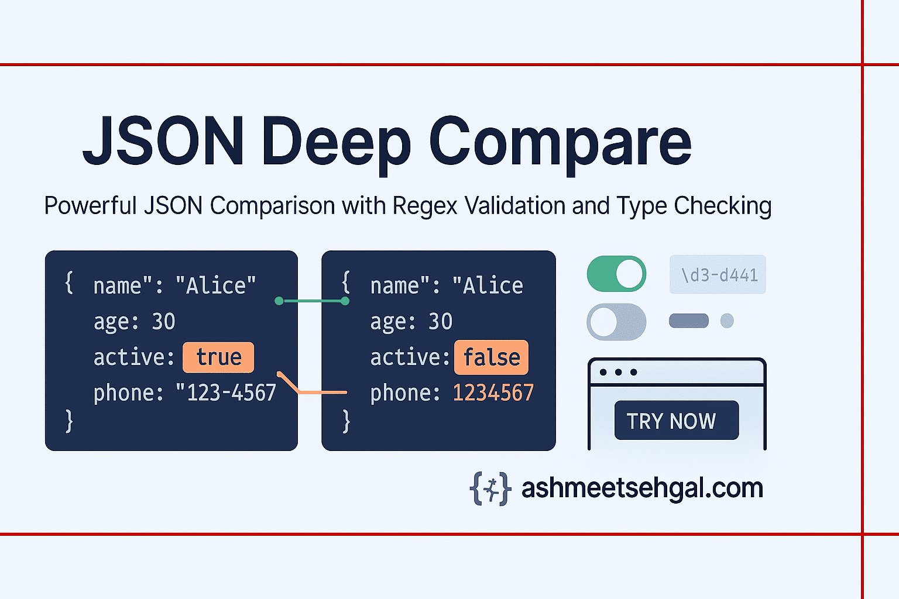

# JSON Deep Compare with Field Validator



[](https://github.com/ashmeetsehgal/json-deep-compare/actions/workflows/test.yml)
[](https://github.com/ashmeetsehgal/json-deep-compare/actions/workflows/coverage.yml)
[](https://github.com/ashmeetsehgal/json-deep-compare/actions/workflows/pr-validation.yml)

[](https://github.com/ashmeetsehgal/json-deep-compare/actions/workflows/npm-publish-on-merge.yml)
[](https://www.npmjs.com/package/json-deep-compare)
[](https://github.com/ashmeetsehgal/json-deep-compare/blob/main/LICENSE)
[](https://ashmeetsehgal.com)

A powerful and flexible library for comparing JSON objects with support for deep comparison, regex validation, and customizable options.

## Playground

Try before you implement! Test the library's capabilities and experiment with different comparison options using our interactive playground:

**[JSON Deep Compare Playground](https://ashmeetsehgal.com/tools/json-compare)**

The playground allows you to:
- Compare JSON objects in real-time
- Customize comparison options
- Visualize match results and differences
- Test regex validations

## Features

- **Deep Comparison**: Perform a deep comparison of JSON objects, including nested objects and arrays.
- **Advanced Type Checking**: Compare values with precise type detection, identifying specific data types (string, number, array, object, null, etc.) and providing detailed type mismatch information.
- **Key and Value Type Comparison**: Compare both keys and value types, ensuring that mismatches in types are reported.
- **Regex Checks**: Validate string values against regex patterns, with support for both exact path matching and key name matching.
- **Result Structure**: Get results in a structured format that clearly indicates matched keys and values, unmatched keys, unmatched values, and regex check results.
- **Customizable Options**: Customize the comparison behavior with options for ignoring specific keys, treating certain values as equivalent, and handling different data types.
- **TypeScript Support**: Full TypeScript type definitions included for better development experience.
- **Performance Optimized**: Designed to efficiently handle large JSON objects.

## Installation

```bash
npm install json-deep-compare
```

You can also install from GitHub Packages. See [Publishing Documentation](./docs/npm-publishing.md) for details.

## Basic Usage

```javascript
const JSONCompare = require('json-deep-compare');

// Create objects to compare
const obj1 = {
  user: {
    name: "Ashmeet Sehgal",
    email: "ashmeet@ashmeetsehgal.com",
    details: {
      phone: "+91-9876543210"
    }
  },
  products: [
    { id: "PROD-123", name: "Product 1" }
  ]
};

const obj2 = {
  user: {
    name: "Ashmeet Sehgal",
    email: "contact@ashmeetsehgal.com", // Different email
    details: {
      phone: "+91-9876543210"
    }
  },
  products: [
    { id: "PROD-123", name: "Product 1" }
  ]
};

// Create a comparator with regex checks
const comparator = new JSONCompare({
  regexChecks: {
    'email': /^[a-zA-Z0-9._%+-]+@[a-zA-Z0-9.-]+\.[a-zA-Z]{2,}$/,
    'phone': /\+\d{1,3}-\d{3,14}/,  // Will match any key named 'phone'
    'products[0].id': /^PROD-\d+$/
  },
  matchKeysByName: true // Enable matching by key name for regex checks
});

// Perform the comparison
const result = comparator.compareAndValidate(obj1, obj2);

console.log(result);
```

## Options

You can customize the comparison behavior with the following options:

```javascript
const options = {
  // Keys to ignore during comparison
  ignoredKeys: ['createdAt', 'updatedAt'],
  
  // Values to treat as equivalent
  equivalentValues: {
    'booleanTypes': [true, 'true', 1],
    'emptyValues': [null, undefined, '']
  },
  
  // Regex patterns for value validation
  regexChecks: {
    'email': /^[a-zA-Z0-9._%+-]+@[a-zA-Z0-9.-]+\.[a-zA-Z]{2,}$/,
    'user.details.phone': '\\+\\d{1,3}-\\d{3,14}',  // String pattern
    'products[0].id': /^PROD-\d+$/
  },
  
  // Whether to strictly compare types
  strictTypes: true,
  
  // Whether to ignore keys in obj2 that aren't in obj1
  ignoreExtraKeys: false,
  
  // Whether to match regex by key name instead of only by path
  matchKeysByName: true
};

const comparator = new JSONCompare(options);
```

## Customizing Array Comparison

The `arrayComparisonStrategies` option provides fine-grained control over how arrays at specific JSON paths are compared. This is an object where keys are path strings (e.g., `"users"`, `"products[0].items"`) pointing to arrays in your JSON structure, and values are strategy objects that define the comparison method.

### Available Strategies

#### 1. Exact Comparison (Default)
*   **Strategy Object**: `{ type: 'exact' }`
*   **Description**: This is the default behavior if no specific strategy is defined for an array path. Arrays must have the same length, and elements must be in the same order. Corresponding elements are then compared recursively.
*   **Differences Reported**: Length mismatches, value/type differences at specific indices.

#### 2. Set Comparison
*   **Strategy Object**: `{ type: 'set' }`
*   **Description**: This strategy treats arrays as unordered sets. Both arrays must have the same length and contain the same elements, but the order of elements does not matter. The frequency of each distinct element must be the same in both arrays.
*   **Example**:
    ```javascript
    // obj1 = { tags: [1, 2, 2, 3] }
    // obj2 = { tags: [3, 1, 2, 2] }
    // With arrayComparisonStrategies: { 'tags': { type: 'set' } } -> these would match.
    
    // obj1 = { tags: [1, 2, 3] }
    // obj2 = { tags: [1, 2, 4] }
    // With set strategy -> reports element '3' missing from obj2 and '4' as extra in obj2 (or count differences).
    ```
*   **Differences Reported**: Array length mismatches, element count differences (e.g., "Element 'X' count: 2 in obj1, count: 1 in obj2").

#### 3. Key-Based Comparison
*   **Strategy Object**: `{ type: 'key', keyName: 'yourKey' }` (e.g., `keyName: 'id'`)
*   **Description**: This strategy is designed for comparing arrays of objects, where each object can be uniquely identified by the value of one of its properties (specified by `keyName`). Objects from both arrays are paired based on this key. The order of objects in the arrays does not matter, and the arrays can be of different lengths. Once paired, the objects themselves are recursively compared.
*   **Example**:
    ```javascript
    // obj1 = { users: [ {id:1, name:'Alice'}, {id:2, name:'Bob'} ] }
    // obj2 = { users: [ {id:2, name:'Bob'}, {id:1, name:'Alice'} ] }
    // With arrayComparisonStrategies: { 'users': { type: 'key', keyName: 'id' } } -> match.
    
    // obj1 = { items: [ {itemId:'A', val:10} ] }
    // obj2 = { items: [ {itemId:'A', val:10}, {itemId:'B', val:20} ] }
    // With key strategy for 'items' (keyName: 'itemId') -> reports item with itemId:'B' as extra in obj2.
    ```
*   **Differences Reported**:
    *   Differences within matched objects (e.g., `users[id=1].name` mismatch).
    *   Objects present in one array but not the other (reported by their key, e.g., "Element with key 'X' exists in first array...").
    *   Structural issues like missing `keyName` property in an object, or duplicate `keyName` values within the same array.
    *   The path for differences within keyed objects is typically reported as `arrayName[keyName=keyValue].propertyName`.

### Example Usage of `arrayComparisonStrategies`

```javascript
const JSONCompare = require('json-deep-compare'); // or import via ES6 modules

const obj1 = {
  id: 101,
  name: "Product A",
  meta: {
    lastUpdated: "2024-01-01"
  },
  tags: ["electronics", "gadget", "popular"],
  components: [
    { partId: "P001", name: "Screen", details: { supplier: "S1"} },
    { partId: "P002", name: "Battery", details: { supplier: "S2"} }
  ],
  misc: [ { type: "manual", lang: "en"}, { type: "warranty", duration: 12}]
};

const obj2 = {
  id: 101,
  name: "Product A",
  meta: {
    lastUpdated: "2024-01-15" // Different value
  },
  tags: ["gadget", "electronics", "popular"], // Same elements, different order
  components: [
    { partId: "P002", name: "Battery", details: { supplier: "S2"} }, // Different order
    { partId: "P001", name: "Screen", details: { supplier: "S1"} } 
  ],
  misc: [ { type: "warranty", duration: 12}, { type: "manual", lang: "en"}] // Default 'exact' comparison will fail due to order
};

const comparator = new JSONCompare({
  ignoredKeys: ['meta.lastUpdated'], // Ignoring a specific field
  arrayComparisonStrategies: {
    'tags': { type: 'set' },                            // Compare 'tags' array as a set
    'components': { type: 'key', keyName: 'partId' }    // Compare 'components' by 'partId'
    // 'misc' will use the default 'exact' comparison strategy
  }
});

const result = comparator.compare(obj1, obj2);
/*
Expected outcome for 'result' with these objects and options:
- obj1.meta.lastUpdated vs obj2.meta.lastUpdated: Difference ignored due to `ignoredKeys`.
- obj1.tags vs obj2.tags: Match, because 'set' strategy ignores order.
- obj1.components vs obj2.components: Match, because 'key' strategy (on 'partId') ignores order and objects are otherwise identical.
- obj1.misc vs obj2.misc: Mismatch, because default 'exact' strategy is used and order is different.
  - result.unmatched.values would show differences for misc[0] and misc[1].
*/

console.log(JSON.stringify(result, null, 2));
// To check if everything matched as intended (ignoring 'misc' for this specific example):
// const miscDifferences = result.unmatched.values.filter(v => v.path.startsWith('misc'));
// const otherDifferences = result.unmatched.values.filter(v => !v.path.startsWith('misc'));
// console.log("Matches excluding 'misc' differences:", otherDifferences.length === 0);

```

## Result Structure

The comparison result has the following structure:

```javascript
{
  matched: {
    keys: [],    // Matched keys
    values: []   // Matched values
  },
  unmatched: {
    keys: [],    // Keys found in one object but not the other
    values: [],  // Values that don't match
    types: []    // Values with mismatched types
  },
  regexChecks: {
    passed: [],  // Values that passed regex validation
    failed: []   // Values that failed regex validation
  },
  summary: {
    matchPercentage: 0,     // Percentage of matched elements
    totalKeysCompared: 0,   // Total number of keys compared
    totalMatched: 0,        // Total number of matched elements
    totalUnmatched: 0,      // Total number of unmatched elements
    totalRegexChecks: 0     // Total number of regex checks performed
  }
}
```

## Advanced Usage

### Matching by Key Name

With the `matchKeysByName` option set to `true`, the library will apply regex checks to all keys with matching names, not just exact paths. This is useful for validating all fields of a specific type regardless of their location in the object.

```javascript
const comparator = new JSONCompare({
  regexChecks: {
    'email': /^[a-zA-Z0-9._%+-]+@[a-zA-Z0-9.-]+\.[a-zA-Z]{2,}$/
  },
  matchKeysByName: true
});

// This will validate both user.email and customer.email fields
```

### Treating Values as Equivalent

You can define sets of values that should be treated as equivalent:

```javascript
const comparator = new JSONCompare({
  equivalentValues: {
    'booleanTypes': [true, 'true', 1],
    'emptyValues': [null, undefined, '']
  }
});

// true, 'true', and 1 will be considered equivalent
// null, undefined, and '' will be considered equivalent
```

### Ignoring Extra Keys

If you only care about whether obj2 contains all the keys from obj1, you can ignore extra keys:

```javascript
const comparator = new JSONCompare({
  ignoreExtraKeys: true
});

// Keys in obj2 that aren't in obj1 will be ignored
```

## Type Checking

The library includes advanced type checking capabilities to identify and report the specific types of values being compared.

### Supported Types

The following types are precisely detected:
- Primitive types: `string`, `number`, `boolean`, `undefined`
- Complex types: `array`, `object`, `null`
- Special objects: `date`, `regex`
- Custom object types based on constructor name

### Type Checking Example

```javascript
const JSONCompare = require('json-deep-compare');

const obj1 = {
  id: 1,                     // Number
  name: "Product",           // String
  price: "19.99"             // String (will be compared with a number)
};

const obj2 = {
  id: "1",                   // String (type mismatch with obj1.id)
  name: "Product",           // String (matching)
  price: 19.99               // Number (type mismatch with obj1.price)
};

// Create a JSONCompare instance
const compare = new JSONCompare({
  strictTypes: false  // Set to true to fail comparison on type mismatches
});

// Perform the comparison
const result = compare.compare(obj1, obj2);

// Check for type mismatches
if (result.unmatched.types.length > 0) {
  console.log("Type mismatches found:");
  result.unmatched.types.forEach(mismatch => {
    console.log(`Path: ${mismatch.path}`);
    console.log(`Expected type: ${mismatch.expected}, Actual type: ${mismatch.actual}`);
  });
}
```

### Strict Type Checking

When `strictTypes` is set to `true`, the comparison will stop at the first type mismatch for each path:

```javascript
const strictCompare = new JSONCompare({ strictTypes: true });
const strictResult = strictCompare.compare(obj1, obj2);
```

### Type Information in Results

Type information is included in both matched and unmatched values:

```javascript
// For matched values
{
  path: "name",
  value: "Product",
  type: "string"
}

// For unmatched values
{
  path: "id",
  expected: 1,
  actual: "1",
  expectedType: "number",
  actualType: "string",
  message: "Values do not match"
}

// For type mismatches
{
  path: "id",
  expected: "number",
  actual: "string",
  message: "Types do not match: expected 'number', got 'string'"
}
```

### Type-Safe Equivalence

When using equivalence rules with different types, the types are still reported correctly:

```javascript
const compare = new JSONCompare({
  equivalentValues: {
    'nullish': [null, undefined]
  }
});

// Result will show:
// "Values considered equivalent by rule 'nullish'"
// but will still report type1: "null", type2: "undefined"
```

## License

MIT

## Support This Project

If you find this library useful for your projects, please consider supporting its development and maintenance:

- ⭐ Star the project on GitHub - It helps increase visibility

Your support helps keep this project maintained and improved with new features!
